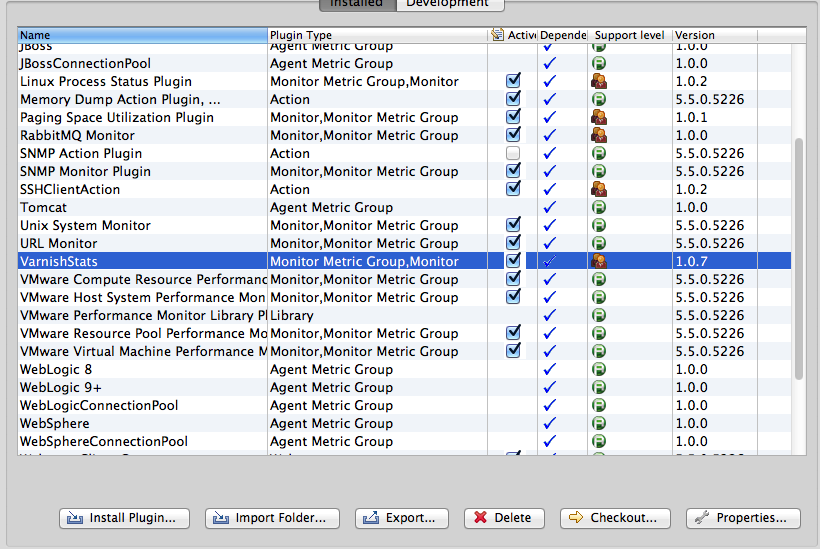
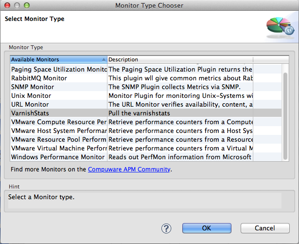
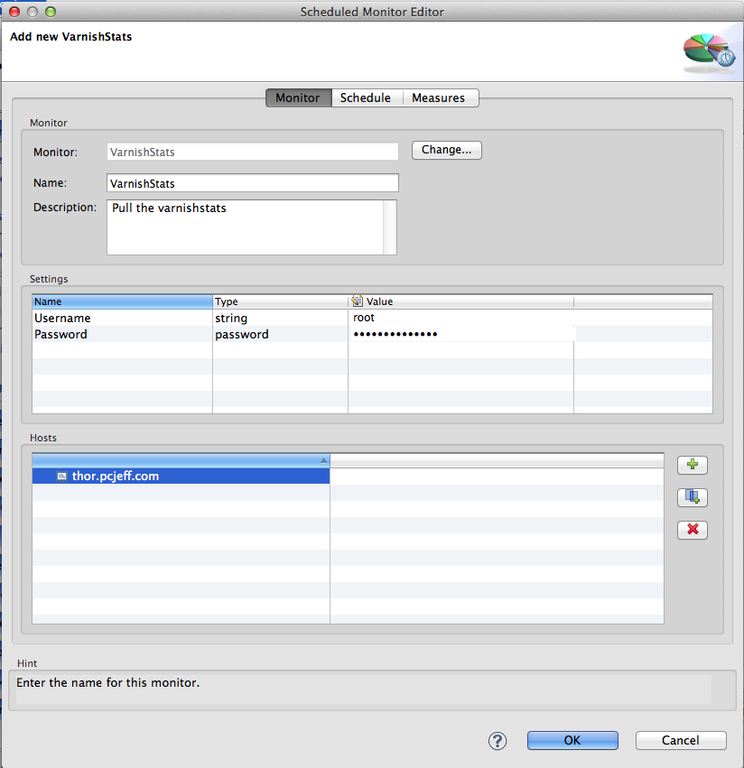
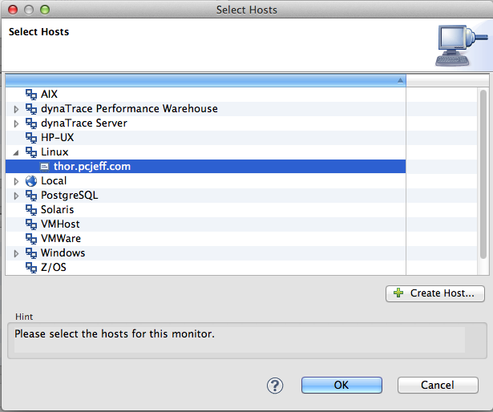
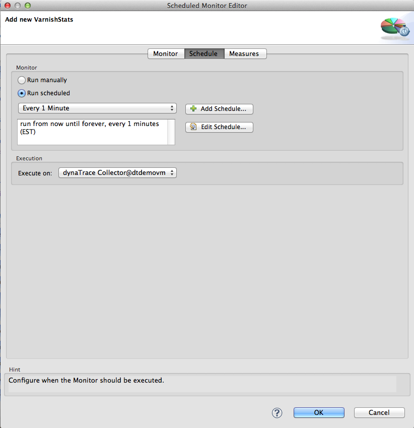
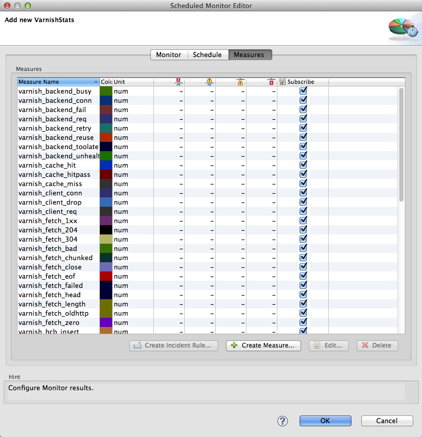
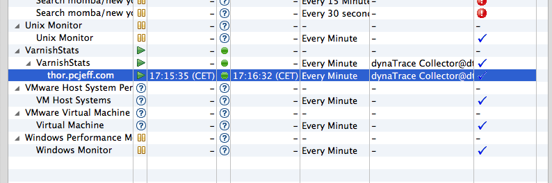
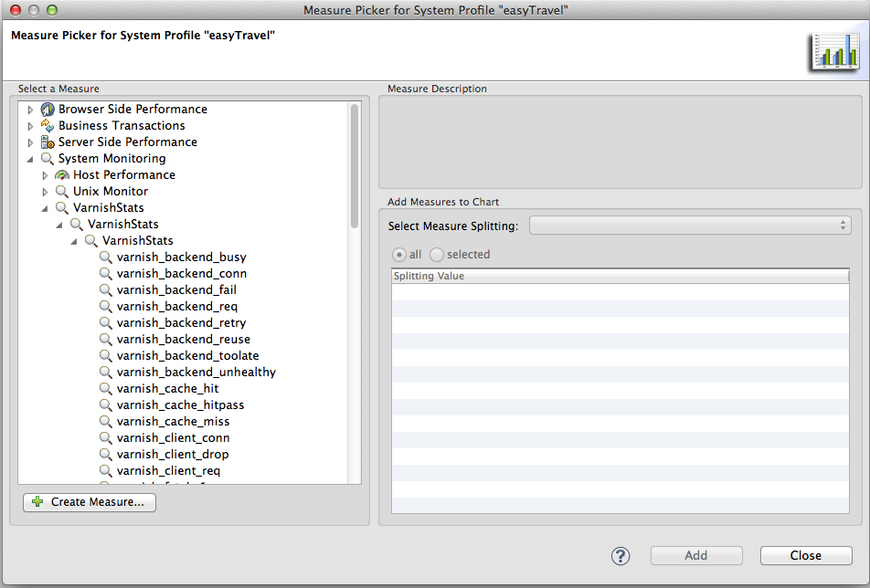

<html xmlns="http://www.w3.org/1999/xhtml">
<head>
    <title>Varnish Stats Monitor Plugin</title>
    <meta http-equiv="Content-Type" content="text/html; charset=UTF-8"/>
    <meta http-equiv="X-UA-Compatible" content="IE=EmulateIE8" />
    <meta content="Scroll Wiki Publisher" name="generator"/>
    <link type="text/css" rel="stylesheet" href="css/blueprint/liquid.css" media="screen, projection"/>
    <link type="text/css" rel="stylesheet" href="css/blueprint/print.css" media="print"/>
    <link type="text/css" rel="stylesheet" href="css/content-style.css" media="screen, projection, print"/>
    <link type="text/css" rel="stylesheet" href="css/screen.css" media="screen, projection"/>
    <link type="text/css" rel="stylesheet" href="css/print.css" media="print"/>
</head>
<body>
                <h1>Varnish Stats Monitor Plugin</h1>
    

            
        Varnish is a web application accelerator.  You install it in front of your web application and it will speed it up significantly.    

    

    
     
The varnishStat Plugin enables monitoring key stats from the varnishstas utility.  The plugin uses ssh to connect to a Linux server and then executesvarnishstats &ndash;j to pull back the varnish stats in Json format.  The plugin then creates the varnish stat measures in dynaTrace by parsing the Json inputStream.    

    

        <table>
<thead class=" "></thead><tfoot class=" "></tfoot><tbody class=" ">    <tr>
            <td rowspan="1" colspan="1">
        

Name and Version    

            </td>
                <td rowspan="1" colspan="1">
        

<a href="attachments_130875553_1_com.dynatrace.diagnostics.plugin.varnish_1.0.7.jar">VarnishStats Monitoring Plugin</a>    

            </td>
                <td rowspan="1" colspan="1">
                </td>
        </tr>
    <tr>
            <td rowspan="1" colspan="1">
        

Compatible with    

            </td>
                <td rowspan="1" colspan="1">
        

dynaTrace 5.x, 6.x    

            </td>
                <td rowspan="1" colspan="1">
                </td>
        </tr>
    <tr>
            <td rowspan="1" colspan="1">
        

Author    

            </td>
                <td rowspan="1" colspan="1">
        

Jeff Yarbrough    

            </td>
                <td rowspan="1" colspan="1">
                </td>
        </tr>
    <tr>
            <td rowspan="1" colspan="1">
        

<a href="https://community/display/DL/Licenses">License</a>    

            </td>
                <td rowspan="1" colspan="1">
        

<a href="attachments_5275722_2_dynaTraceBSD.txt">dynaTrace BSD</a>    

            </td>
                <td rowspan="1" colspan="1">
        

    

            </td>
        </tr>
    <tr>
            <td rowspan="1" colspan="1">
        

<a href="https://community/display/DL/Support+Levels">Support Level</a>    

            </td>
                <td rowspan="1" colspan="1">
        

<a href="https://community.compuwareapm.com/community/display/DL/Support+Levels#SupportLevels-Community">Not Supported </a> If you have any questions or suggestions for these plugins, please add a comment to this page, use our <a href="https://community.dynatrace.com/community/pages/viewpage.action?pageId=46628918">forum</a>, or drop us an email at <a href="mailto:community@dynatrace.com">community@dynatrace.com</a>!    

            </td>
                <td rowspan="1" colspan="1">
        

    

            </td>
        </tr>
    <tr>
            <td rowspan="1" colspan="1">
        

Download    

            </td>
                <td rowspan="1" colspan="1">
        

<a href="attachments_130875553_1_com.dynatrace.diagnostics.plugin.varnish_1.0.7.jar">varnishstat.1.0.7</a>    

    

<a href="attachments_156632336_1_com.dynatrace.diagnostics.plugin.Varnish_1.0.8.jar">varnishstat.1.0.8</a>    

            </td>
                <td rowspan="1" colspan="1">
                </td>
        </tr>
    <tr>
            <td rowspan="1" colspan="1">
        

Installation    

            </td>
                <td rowspan="1" colspan="1">
        

Import the plugin into dynaTrace server    

            </td>
                <td rowspan="1" colspan="1">
                </td>
        </tr>
    <tr>
            <td rowspan="1" colspan="1">
        

Release History    

            </td>
                <td rowspan="1" colspan="1">
        

2013-07-25 Initial Release    

            </td>
                <td rowspan="1" colspan="1">
                </td>
        </tr>
</tbody>        </table>
            

    

        <h2>Steps:</h2>
    

        <h3>Import Plugin:</h3>
    

            
            

    

Import the Plugin into the dynaTrace Server. For details how to do this please refer to the <a href="https://community.dynatrace.com/community/display/DOCDT50/Manage+and+Develop+User+Plugins">dynaTrace documentation</a>.    

    

After you import the plugin you will see the plugin as VarnishStats, type of plugin &quot;Monitor Metric Group, Monitor&quot;.    

    

    

        <h3>Setup Monitor:</h3>
    

Under your system profile, you will need to create a monitor for the varnish plugin.  Select Monitors under the profile and select &quot;Create&quot;.    

    

            
            

    

Select the VarnishStats monitor and click &quot;ok&quot;.    

    

    

        <h3>Configure Monitor:</h3>
    

You will need to provide the login credentials (username/password) for the Linux host and give the monitor a name.    

    

            
            

    

Make sure to add a host or hosts to the host configuration.    

    

            
            

    

Set the schedule,    

    

            
            

    

(Optionally) You can select which measures you would like to subscribe.    

    

            
            

    

Click &quot;OK&quot;, then you should see the Monitor has been created.    

    

            
            

    

    

        <h3>Validation:</h3>
    

You will need select the monitor and click &quot;Run Now&quot;, the monitor should display a green indicator to let you know everything worked.    

    

    

        <h3>Measures:</h3>
    

You can now see the measure for VarnishStats under &quot;System Monitoring&quot;.    

    

            
            

    

    

        <h3>Configuration</h3>
    

        <table>
<thead class=" ">    <tr>
            <td rowspan="1" colspan="1">
        

Name    

            </td>
                <td rowspan="1" colspan="1">
        

Value    

            </td>
        </tr>
</thead><tfoot class=" "></tfoot><tbody class=" ">    <tr>
            <td rowspan="1" colspan="1">
        

Username    

            </td>
                <td rowspan="1" colspan="1">
        

The username to use for authentication to the restful interface    

            </td>
        </tr>
    <tr>
            <td rowspan="1" colspan="1">
        

Password    

            </td>
                <td rowspan="1" colspan="1">
        

The password for the username used to authenticate to the restful interface.    

            </td>
        </tr>
    <tr>
            <td rowspan="1" colspan="1">
        

command    

            </td>
                <td rowspan="1" colspan="1">
        

(optional) default is &quot;varnish stat -j&quot;    

            </td>
        </tr>
</tbody>        </table>
            

    

    

            

        

        

        

    

</body>
</html>
